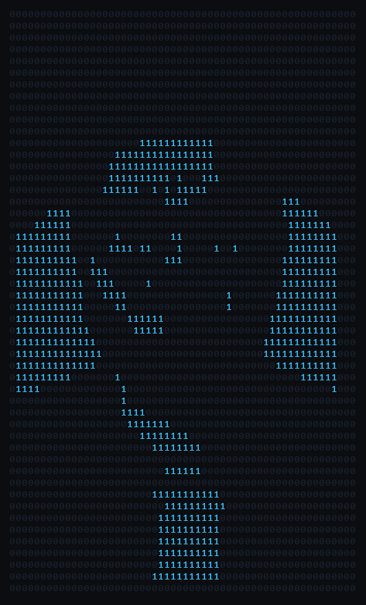
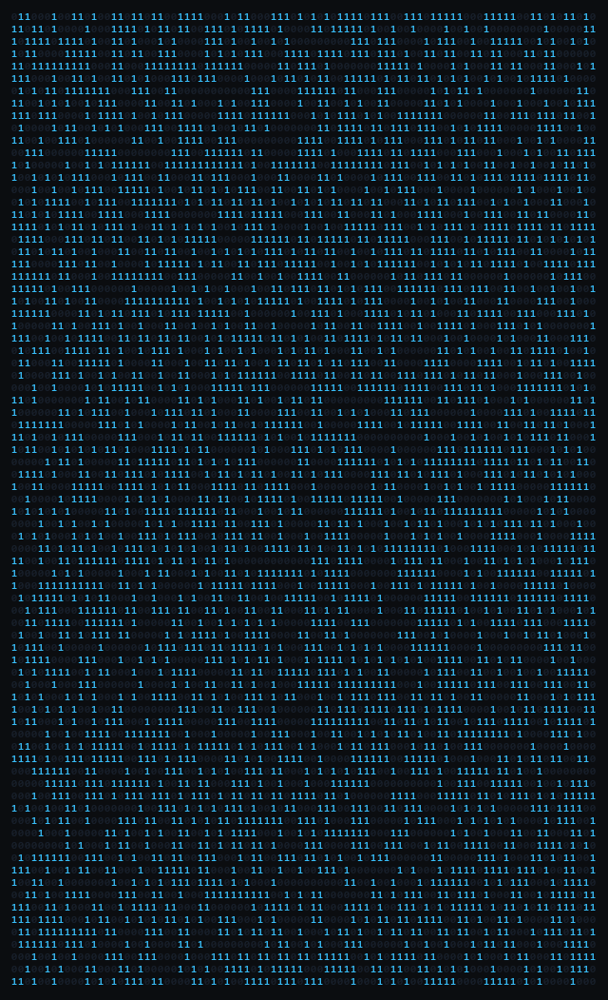

<div align="center">



<br/>



# Hicham AGRAD

[](https://github.com/hichamagrad)

I study how systems break so I can help build ones that don't. My focus areas are offensive security, secure software development, and the security challenges of AI-integrated platforms. Currently a cybersecurity intern at **YAZAKI Morocco**, working on risk prevention for an internal AI platform.

[](https://www.linkedin.com/in/hicham-agrad)
[](https://github.com/hichamagrad/hicham-cybersecurity-portfolio)
[](mailto:Hicham.Agrad@emsi-edu.ma)

</div>


## `$ whoami`

```text
┌──[ hicham@rabat ]──[ ~/identity ]
│
│  $ whoami
│  Cybersecurity Engineering Student @ EMSI (2025-2026)
│
│  $ current
│  Cybersecurity Intern, AI Platform Risk Prevention @ YAZAKI Morocco
│
│  $ focus
│  Offensive Security · AI Security · Network Security · Secure Software
│
│  $ status
│  Building. Auditing. Securing.
│
└──[ end ]
```


## Digital Identity

<div align="center">

</div>

<div align="center"><sub>Rendered entirely from <code>0</code> and <code>1</code>. A static high-resolution version is in <a href="assets/binary-portrait-desktop.png">assets/binary-portrait-desktop.png</a>.</sub></div>


## About

I'm an engineering student specializing in cybersecurity at **EMSI** (École Marocaine des Sciences de l'Ingénieur), focused on offensive security, secure software development, and, more recently, the security challenges specific to AI-integrated systems.

That focus shows up in what I build: a security monitoring stack I self-audited and hardened, an LLM auditing platform mapped to OWASP's LLM Top 10 and MITRE ATLAS, and a self-monitoring network built around proper segmentation. I'm currently applying the same mindset as a cybersecurity intern at **YAZAKI Morocco**, working on risk prevention for an internal AI platform.

Full write-up, project case studies, and downloadable résumé (EN/FR): **[portfolio source on GitHub](https://github.com/hichamagrad/hicham-cybersecurity-portfolio)** <sub>(live URL to follow once deployed)</sub>


## Current Focus

```
[ 01 ] Offensive Security        ●●●●○  hands-on via CTFs, pentesting labs
[ 02 ] AI & LLM Security         ●●●●●  SentinelLLM + YAZAKI internship
[ 03 ] Network Security          ●●●●○  segmentation, monitoring, Zabbix
[ 04 ] Secure Software Dev       ●●●●○  React/Next.js, FastAPI, Django, Laravel
```

<sub>These bars reflect relative time investment, not a scored skill level; no fabricated percentages.</sub>


## Technical Skills

**Security & Testing**


**AI Security**


**Network & Infrastructure**


**Programming**


**Web & Backend**


**Data & Monitoring**


**Systems & DevOps**


## Featured Projects

### 🛡️ [SecureWatch](https://github.com/hichamagrad/securewatch): Security Monitoring Platform
Self-hosted SOC-style stack: log centralization, real-time incident detection, and infrastructure metrics across a microservices architecture, built and then deliberately attacked to find its own weaknesses.
**Self-audited and hardened: 10 vulnerabilities identified and fixed**, including a forged-JWT authentication bypass, stored XSS in the log viewer, and unauthenticated exposure of Elasticsearch and Prometheus.
`Python` `ELK Stack` `Prometheus` `Grafana` `Docker` `Nginx`

### 🤖 [SentinelLLM](https://github.com/hichamagrad/sentinelllm): LLM Security Auditing Platform
Runs structured red-team tests (prompt injection, jailbreaks, unsafe code generation, PII leakage) against any connected model, maps findings to the **OWASP LLM Top 10** and **MITRE ATLAS**, and generates exportable PDF audit reports. Multi-provider: OpenAI, Azure OpenAI, Mistral, Ollama.
`FastAPI` `PostgreSQL` `Celery` `Redis` `React` `TypeScript` `Docker`

### 🕵️ [Real-Time Face Recognition System](https://github.com/hichamagrad/Systeme-de-Reconnaissance-Faciale-avec-Django)
Django application for real-time facial detection and identification via webcam, built partly as an exploration of the privacy trade-offs in biometric systems.
`Django` `OpenCV` `face_recognition` `Bootstrap` `SQLite`

### 🛒 [Secure E-commerce Platform](https://github.com/hichamagrad/aasPhones)
Laravel storefront with a product catalog, shopping cart, and role-based accounts, built with secure defaults (hashed credentials, CSRF tokens, validated input) rather than bolted-on protection.
`Laravel` `PHP` `MySQL` `Blade`

<div align="center"><sub>More context, screenshots, and problem/solution breakdowns for each project in the <a href="https://github.com/hichamagrad/hicham-cybersecurity-portfolio">portfolio source</a> (live URL to follow once deployed).</sub></div>


## Experience

**Cybersecurity Intern, AI Platform Risk Prevention** · YAZAKI Morocco
*Since July 2026*
Risk prevention and secure-usage practices for an internal AI platform: usage governance, security controls, and identifying misuse risks specific to AI-assisted workflows.

**Frontend Developer (Intern)** · VOVE ID
*July – August 2025*
Modernized the showcase website and internal dashboard with React and Next.js; reusable dashboard components and Figma mockups turned into pixel-accurate interfaces (remote, Baobab '24 cohort).

**Python Developer (Intern)** · Safran Electrical & Power
*May 2024*
Built Python tools for stock management and internal operations, on-site in an industrial engineering environment.


## GitHub Stats

<div align="center">


</div>

<sub>⚠️ The stats/top-languages cards above depend on the shared <code>github-readme-stats</code> instance, which was returning a "deployment paused" error at the time of writing (a known, recurring issue with that free shared service, unrelated to this profile). It typically self-resolves; see <a href="GITHUB_PROFILE_AUDIT.md">GITHUB_PROFILE_AUDIT.md</a> for details and a fallback plan.</sub>


## Contribution Snake

<div align="center">
<picture>
  <source media="(prefers-color-scheme: dark)" srcset="https://raw.githubusercontent.com/hichamagrad/hichamagrad/output/snake-dark.svg" />
  <source media="(prefers-color-scheme: light)" srcset="https://raw.githubusercontent.com/hichamagrad/hichamagrad/output/snake-light.svg" />
  
</picture>
</div>


## Certifications & Learning

**Cloud**
- Oracle Cloud Infrastructure Certified Foundations Associate, Oracle University *(2026)*

**Systems**
- Red Hat Linux Administration RH124, Honoris (Red Hat Academy) *(2026)*

**Programming & AI**
- Python for Data Science, AI & Development, IBM *(2025)*
- Introduction à la programmation orientée objet (C++), EPFL *(2024)*
- Interactivity with JavaScript, University of Michigan *(2024)*
- Fundamentals of Blockchain Architecture, LearnQuest *(2026)*

**Other**
- Agile Project Management, Google *(2026)*
- Software Engineering: Software Design and Project Management, HKUST *(2025)*
- La recherche documentaire, École Polytechnique *(2025)*


## Contact

<div align="center">

[](https://www.linkedin.com/in/hicham-agrad)
[](https://github.com/hichamagrad/hicham-cybersecurity-portfolio)
[](mailto:Hicham.Agrad@emsi-edu.ma)

Rabat, Morocco · Open to internships and opportunities in offensive and defensive security.

</div>



<div align="center"><sub>Building secure systems. Learning continuously.</sub></div>
